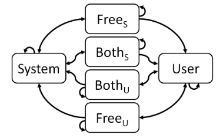

# The Finite-State Turn-Taking Machine
  Finite-State Turn-Taking Machine (FSTTM), a model to control the turn-taking behavior of conversational agent
  (https://aclanthology.org/N09-1071.pdf)



## Install

```shell
sudo apt install portaudio19-dev
CMAKE_ARGS="-DLLAMA_CUBLAS=on -DWHISPER_CUBLAS=on" FORCE_CMAKE=1 LLAMA_CUBLAS=1 WHISPER_CUBLAS=1 pip install -r requirements.txt
```
NB: whispercpp failing CI but can be installed from repo using bazel

- Memory management
  (https://arxiv.org/pdf/2308.15022.pdf)

- Rule based
  (https://www.businessrulesgroup.org/brmanifesto.htm)


## Speech-to-Intent
Combining Rasa NLU with a language model like can create a comprehensive conversational AI system. Here’s a general approach to combining these two:

  1.  Rasa NLU for Intent Recognition and Entity Extraction:
        Train your Rasa NLU model using annotated data to recognize intents and extract entities from user inputs.
        Define intents (what the user wants) and entities (specific details related to the request) within Rasa.

  2.  Integration with a Language Model:
        Use the recognized intents and extracted entities from Rasa to determine the context or purpose of the conversation.
        Utilize this context to generate appropriate prompts or responses using the language model.
        Pass the context or key information obtained from Rasa to the language model as a prompt to generate human-like responses.

  (https://rasa.com/docs/rasa/tuning-your-model/)
  (https://rhasspy.readthedocs.io/en/latest/)

## HW section
- (https://wiki.seeedstudio.com/ReSpeaker_4_Mic_Array_for_Raspberry_Pi/)
- (https://github.com/Picovoice/picovoice/blob/master/demo/respeaker/pvrespeakerdemo/picovoice_demo.py)

## GPT Models

High-performance inference of OpenAI's Whisper automatic speech recognition (ASR) model
(https://github.com/ggerganov/whisper.cpp)

Run the LLaMA model using 4-bit integer quantization
(https://github.com/ggerganov/llama.cpp)

Open-source assistant-style large language model based on GPT-J and LLaMa
(https://github.com/nomic-ai/gpt4all)

Gpt4All Web UI Flask web application
(https://github.com/nomic-ai/gpt4all-ui)


## Glue scripts

- Pybind11 bindings for whisper.cpp
  (https://github.com/aarnphm/whispercpp)

- Python Bindings for llama.cpp
  (https://github.com/abetlen/llama-cpp-python)


## Voice activity detection (VAD)
- Mozzila VAD
  (https://github.com/mozilla/DeepSpeech-examples)

- Adjust_for_ambient_noise
  (https://github.com/Uberi/speech_recognition/blob/master/speech_recognition/__init__.py)

- Monitor module for controll and testing

```
  : pactl list short | egrep "alsa_(input|output)" | fgrep -v ".monitor"
  : pactl load-module module-loopback
	sudo sh -c ' echo "load-module module-loopback" >>  /etc/pulse/default.pa '
```

- testing from monitor

  In pavcontroll in Recording set sink to Monitor

```
fortune  |tee `strace -o spork tty | tr --delete '\n\r'` | RHVoice-client  -s  SLT -r 0.6 -v -0.1 | aplay

```


- Echo cross cancelation in time domain /etc/pulse/default.pa

```
.ifexists module-echo-cancel.so
load-module module-echo-cancel aec_method=webrtc source_name=echocancel sink_name=echocancel1
set-default-source echocancel
set-default-sink echocancel1
.endif
```

- Enable echo cancelation for this session

```
#!/usr/bin/env bash
pactl unload-module module-echo-cancel
pactl load-module module-echo-cancel aec_method=webrtc source_name=echocancel sink_name=echocancel1
pacmd set-default-source echocancel
pacmd set-default-sink echocancel1
```


### Voice stream

- mic_vad.py

```
    FORMAT = pyaudio.paInt16
    # Network/VAD rate-space
    RATE_PROCESS = 16000
    CHANNELS = 1
    BLOCKS_PER_SECOND = 50
```

```
    vad_audio = VADAudio(loop,
                        aggressiveness=3,
                        device=0,
                        input_rate=16000)

 'device': 0,
  # rate
 'input_rate': 16000,
  #
 'sample_rate': 16000,
  # RATE_PROCESS / BLOCKS_PER_SECOND
 'block_size': 320,
  # frames_per_buffer; RATE_PROCESS / BLOCKS_PER_SECOND
 'block_size_input': 320,


 len(frame) == 640
 VAD rate ~ 20 f/s
 ```


