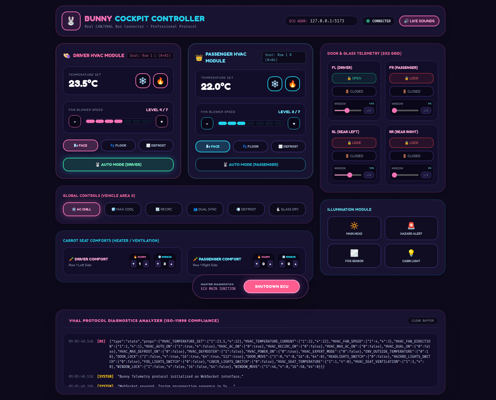

# HVAC React + Backend

A React HVAC cockpit UI with a Python FastAPI backend that models the
Android VHAL property system and can be driven externally over JSON.



*Dual-zone climate, global controls, seat comforts, door/window telemetry,
lighting, and a live VHAL protocol diagnostics console — all driven over the
WebSocket/REST VHAL protocol below.*

```
hvac-react/
├── backend/          FastAPI server + VHAL property model
│   ├── vhal.py         property catalogue, zones, ranges (mirrors CarHvacManager)
│   ├── controller.py   high-level ops (mirrors ClimateControlViewModel)
│   ├── server.py       REST + WebSocket JSON API
│   └── requirements.txt
├── frontend/         React (Vite + Tailwind) cockpit dashboard
│   ├── src/App.jsx     the whole UI + inline WebSocket client
│   └── src/styles.css  Tailwind directives
├── python-client/    example external controller (hvac_client.py)
└── docs/             screenshots
```

## UI

`frontend/src/App.jsx` is a single self-contained React component (styled with
Tailwind) that renders the whole cockpit and talks to the backend over the
WebSocket/REST protocol below:

- **Dual-zone climate** — per-zone temperature, fan speed, air direction
  (FACE/FLOOR/DEFROST bitmask), and AUTO.
- **Global controls** — A/C, MAX A/C, recirculate, dual/sync, max defrost,
  rear-window defroster.
- **Seat comforts** — per-seat heat and ventilation levels.
- **Door & glass telemetry** — per-door lock, open/close, window position slider,
  window lock.
- **Illumination** — headlights, hazards, fog, cabin lights.
- **VHAL diagnostics console** — live TX/RX log of every command and delta frame.

The UI is a pure mirror of backend state (no optimistic writes): it sends a
command and waits for the echoed `delta`, so it always shows the server's
coerced value. See [`PROTOCOL.md`](PROTOCOL.md) for the state-flow details.

## Running

### 1. Backend

```bash
cd backend
python3 -m venv .venv && . .venv/bin/activate
pip install -r requirements.txt
uvicorn server:app --host 127.0.0.1 --port 8000
```

### 2. Frontend (dev)

```bash
cd frontend
npm install
npm run dev          # http://127.0.0.1:5173  (proxies /state, /command, /ws to :8000)
```

Or build static assets with `npm run build` (output in `frontend/dist`).

## External control (the Python interface)

The backend speaks JSON over REST and WebSocket. The protocol mirrors VHAL:
properties are addressed by name + area (VehicleAreaSeat bitmask).

> **Full control-protocol and state-management reference: [`PROTOCOL.md`](PROTOCOL.md).**
> It documents every command, message type, property, and the
> single-source-of-truth state flow between the backend, the React UI, and
> external clients.

```bash
cd python-client
python3 hvac_client.py demo                     # scripted sequence
python3 hvac_client.py state                    # dump all properties
python3 hvac_client.py set HVAC_FAN_SPEED 1 5    # name area value
python3 hvac_client.py action power_toggle
python3 hvac_client.py action set_expert_mode on=true
```

Any change made externally is pushed to the React UI live over the WebSocket,
and any change made in the UI is reflected back to all clients.

### Protocol summary

REST:
- `GET /state` → `{type:"state", props:{NAME:{area:value}}}`
- `GET /config` → property catalogue (types, areas, ranges, enums)
- `POST /command` → `{cmd:"set"|"action"|"get_state", ...}`
- `POST /set/{name}` → `{area, value}`

WebSocket `/ws` (bidirectional):
- server → client: `{type:"state", props}` on connect, `{type:"delta", changes}` on change
- client → server: same command objects as `POST /command`

High-level actions (mirror `ClimateControlViewModel`): `bump_temperature`,
`update_temperature`, `bump_fan_speed`, `update_fan_speed`,
`fan_direction_toggle`, `auto_toggle`, `dual_toggle`, `ac_toggle`,
`recirc_toggle`, `ac_max_toggle`, `max_defrost_toggle`,
`window_defrost_toggle`, `power_toggle`, `set_expert_mode`.

### Property names (← CarHvacManager.ID_*)

`HVAC_TEMPERATURE_SET`, `HVAC_TEMPERATURE_CURRENT`, `HVAC_FAN_SPEED`,
`HVAC_FAN_DIRECTION` (bitmask FACE=1/FLOOR=2/DEFROST=4), `HVAC_AUTO_ON`,
`HVAC_AC_ON`, `HVAC_RECIRC_ON`, `HVAC_MAX_AC_ON`, `HVAC_DUAL_ON`,
`HVAC_MAX_DEFROST_ON`, `HVAC_DEFROSTER`, `HVAC_POWER_ON`, `HVAC_EXPERT_MODE`,
`ENV_OUTSIDE_TEMPERATURE`.

Areas use the VehicleAreaSeat bitmask: `ROW_1_LEFT=0x1`, `ROW_1_RIGHT=0x4`.
Area `0` in a command means "apply to all supported zones".
